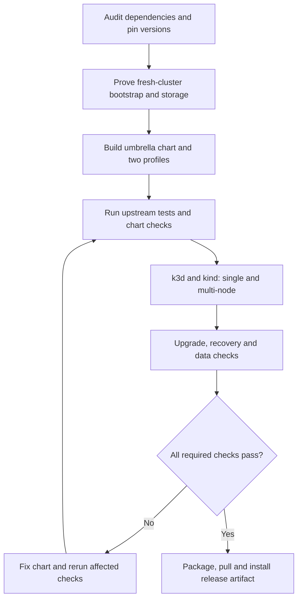

# Standalone Xata Helm chart plan

Status: the current candidate passed all four environments on a disposable GCP Spot VM. GCP testing corrected an NFS kernel compatibility issue, a singleton plugin availability gap, and plugin startup ordering. See `HELM-CHART-VERIFICATION.md` for measured results, distribution evidence and known limits.

## Intended result

Deliver one versioned `xata` umbrella chart, installable from a packaged archive or OCI registry, supporting single-node and multi-node Kubernetes clusters. Consumers should not need this source checkout, Tilt, Kustomize, or manual manifest patches. The cluster must supply working compute, networking and a supported CSI storage driver; the chart exposes explicit storage and snapshot classes.

Use k3d (k3s in Docker), as selected by the user, and kind on a disposable GCP Spot VM. Run clusters sequentially, collect evidence, then explicitly delete the VM and its dedicated resources. Keep kubeconfigs isolated and pass explicit contexts to every test command.

## 1. Establish a reproducible baseline

- Pin the upstream commit, all application/sidecar/Postgres images, dependency charts, CRDs, test tools and Kubernetes node images. Avoid `latest` in release artifacts.
- Verify public image availability and supported CPU architectures. Build from the pinned source where suitable published artifacts are unavailable, retaining licenses and provenance.
- Inventory resources currently created by Tilt, Kustomize, scripts and chart templates: namespaces, RBAC, operators, network policies, databases/users, migrations, realm import, API settings, bootstrap records, backup configuration and observability.
- Run the project's existing tests before changes. Record failures, missing test assets and environment prerequisites separately from regressions introduced by the chart.
- Existing test helpers use Docker-backed PostgreSQL and Kubernetes envtest; configure both. The Makefile references `e2e/`, but that directory is absent in this checkout. Do not count that target as a working deployment test.

## 2. Resolve installation and storage first

- Prove a fresh installation with the pinned Xata-compatible CNPG operator, scale-to-zero integration, Barman, cert-manager, Gateway API/Envoy Gateway, Keycloak and Xata CRDs.
- Decide explicit ownership of shared operators and CRDs: bundled mode for a fresh cluster; existing-dependency mode for clusters already operating compatible versions. Never silently adopt resources owned by another release.
- Test CRD registration and webhook readiness before creating dependent resources. Resolve any single-release installation ordering problems in this phase; ordinary subchart order does not establish readiness.
- Document and test CRD upgrades explicitly. Helm's `crds/` lifecycle does not automatically upgrade or delete CRDs. Do not hide a required second manual installation behind the standalone claim.
- Single-node CI can use the sample CSI HostPath driver for functional testing only.
- For multi-node CI, first qualify NFS CSI with a disposable NFS server and snapshot controller as a portable test fixture: create a PVC, write a fixture, snapshot it, restore it on another worker, and check the checksum. This driver uses archive-based snapshots; it does not establish copy-on-write speed or production storage availability. If it cannot meet Xata's correctness requirements, resolve a compatible backend before accepting multi-node support.
- Keep test storage fixtures separate from production defaults. Production uses an explicitly selected, qualified CSI backend. Do not install a sample host-path driver automatically in a production profile.

## 3. Chart layout and configuration

Add `charts/xata/` with `Chart.yaml`, `Chart.lock`, `values.yaml`, `values.schema.json`, templates, bundled dependencies, Helm test jobs and documentation. Add profile examples, cluster fixtures and CI scripts under dedicated chart-testing paths.

Reuse the existing component charts with narrow improvements where needed. Move required Kustomize patches into documented values/templates. Include:

- Auth, projects, clusters, branch operator, SQL gateway and API routing.
- Optional bundled operators, Keycloak and metadata PostgreSQL; support compatible existing operators and an external metadata database.
- Idempotent database/user bootstrap, migrations and realm initialization with readiness checks. Credentials must stay stable across upgrades; support existing Secrets and never commit generated credentials.
- Configurable namespaces, references, image pull secrets, domain names, TLS, storage classes, backup endpoints and credentials.
- Optional observability and optional persistent object storage for local evaluation. Production backup examples use an external durable destination.
- Disabled or optional hosted-service integrations where they are not required for OSS operation. Do not require dummy billing or messaging credentials just to start.
- Durable-volume and backup retention behavior that is documented and exercised during uninstall/reinstall tests, including operator-owned database resources and cascading deletion.

Two explicit profiles:

| Behavior | Single-node | Multi-node |
|---|---|---|
| Metadata and managed database instances | One by default | Primary plus two replicas by default where supported |
| Stateless service replicas | One | At least two where safe |
| Placement | Schedulable on one node | Spread database instances across distinct workers |
| Rollout/disruption settings | Permit maintenance with measured downtime | Preserve intended availability with tested budgets |
| Operator replicas | Respect controller concurrency/leader-election support | Do not increase blindly; verify safety first |
| Availability claim | Recovery and persistence; no node redundancy | Measured failover under tested conditions |

Validate profile settings, required storage/backup fields and incompatible combinations with schema/template checks. Define the supported Helm and Kubernetes versions from tested combinations.

## 4. Verification matrix

| Distribution | Single-node | Multi-node |
|---|---|---|
| k3d / k3s | One schedulable server | Three servers and three workers |
| kind | One schedulable control-plane node | Three control-plane nodes and three workers |

Use three workers for database placement and three control-plane members for meaningful control-plane loss tests. Disable or integrate k3s's bundled ingress deliberately to avoid conflicting with Envoy. Measure resources for each topology before running it; run one cluster at a time. If the host cannot run a topology, report the missing verification instead of reducing it silently.

Verification layers:

1. **Source tests:** run `make test`, including Go race detection, OPA tests and Keycloak extension tests, with the required toolchain. Reuse applicable assertions/fixtures. These tests support application compatibility but do not prove Helm installation.
2. **Chart checks:** lint, schema checks, render both profiles and existing-dependency variants, validate manifests/CRDs, and check secret/RBAC/reference consistency. Run existing `make lint-charts` and `make lint-kube`; identify baseline issues separately.
3. **Live installation:** install the actual `.tgz` on a clean cluster; require readiness and successful bootstrap. Verify both bundled and existing-dependency modes, including a non-default namespace.
4. **Functional tests:** authenticate through configured routing; create a project/database; write deterministic rows through the SQL gateway; branch and check data/isolation; exercise configured scale-to-zero/wakeup; validate TLS and unauthorized access rejection. Use a dedicated test identity and disposable data.
5. **Data protection:** produce a completed backup and WAL archive, then restore into a separate database and compare fixture checksums. Test point-in-time recovery to a known transaction boundary.
6. **Recovery:** restart services and database pods; test backup destination outage and WAL catch-up. Single-node node restart must recover retained data. Multi-node primary-worker loss must promote a replica and restore writes; verify acknowledged writes against the selected synchronous/asynchronous replication policy. Test control-plane member loss separately.
7. **Upgrade:** establish a passing baseline chart, write data, and upgrade to the candidate under SQL probes. Confirm stable credentials, successful migrations, readiness, unchanged fixture checksums and continued branching/backups. Repeat an identical upgrade to check idempotency. Test supported single-to-multi configuration changes only after adding nodes and confirming storage compatibility.
8. **Rollback/recovery:** exercise Helm rollback only for a supported backward-compatible change; never assume it reverses database migrations or a PostgreSQL major upgrade. Verify backup-based recovery for unsupported rollback paths.
9. **Package portability:** pull/package the chart into a clean directory with no checkout, and install it using only documented configuration. Confirm dependencies, CRDs, jobs and assets are included; chart portability still requires access to pinned container images.

Implement a live-cluster test suite and expose repeatable checks through `helm test` where practical. Keep destructive fault and upgrade tests in the disposable-cluster harness. Fix the chart when a test exposes chart defects, then rerun affected checks and the required release matrix. Do not weaken assertions or alter Xata behavior merely to make chart tests pass.

## 5. Distribution and completion

- Release a semantic-versioned `.tgz`, checksum, pinned dependency lock, configuration reference and tested compatibility table.
- Prepare OCI publication to GHCR under the chosen owner, plus a downloadable archive. Registry owner/repository must be established before publishing; no public publication is part of this planning step.
- CI runs fast source/chart checks on changes and the full cluster/install/upgrade matrix before a release. Preserve concise results, versions, timings and sanitized failure diagnostics.
- Documentation covers quick start, both profiles, existing dependencies, storage requirements, TLS/secrets, backup/restore, upgrades, uninstall retention and measured resource requirements.
- Completion requires all mandatory matrix cells to pass on the packaged artifact, plus the upgrade and data checks. Clearly report anything skipped or blocked. Send the user a completion notification with the artifact and verification report.

Initial planning observation, before execution: Helm 4.1.1, kubectl, kind, k3d, Docker CLI, Go and yq were present. Docker access was subsequently verified outside the sandbox and isolated test clusters were created; current results are in the verification report.

## Sources

- [Current deployment wiring](kustomize/overlays/local/kustomization.yaml)
- [Tilt bootstrap and development resources](Tiltfile)
- [Existing component charts](charts/)
- [Pinned Xata CNPG integration](kustomize/components/xata-cnpg-1.28.0/kustomization.yaml)
- [Project test commands](Makefile)
- [Postgres test helper](internal/pgtestutil/pgtestutil.go)
- [Kubernetes envtest helper](internal/envtestutil/envtestutil.go)
- [Helm chart packaging](https://helm.sh/docs/topics/charts/)
- [Helm CRD lifecycle](https://helm.sh/docs/chart_best_practices/custom_resource_definitions/)
- [OCI distribution](https://helm.sh/docs/topics/registries/)
- [k3d](https://k3d.io/stable/)
- [kind](https://kind.sigs.k8s.io/docs/user/quick-start/)
- [CSI HostPath limitations](https://github.com/kubernetes-csi/csi-driver-host-path)
- [NFS CSI snapshot behavior](https://github.com/kubernetes-csi/csi-driver-nfs/blob/master/docs/driver-parameters.md)
