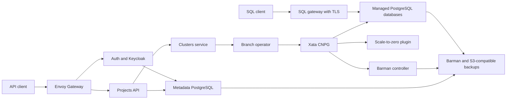

# Xata umbrella chart (preview)

This package assembles the Xata OSS platform without Tilt or Kustomize at installation time. It includes pinned Xata images, Keycloak, a metadata PostgreSQL cluster, the Xata-compatible CNPG operator, Barman and scale-to-zero plugins, cert-manager, Envoy Gateway, bootstrap jobs, and optional RustFS storage for evaluation.

**Tested preview: single-node and six-node k3d/kind environments passed, along with separately managed operators.** Production storage and external service integrations require qualification for your environment. See the included `VERIFICATION.md` (also `HELM-CHART-VERIFICATION.md` in the source repository) for actual results and known gaps.



## Install a packaged chart

Provide a working CSI driver and snapshot controller, a StorageClass with snapshot restore support, and its matching VolumeSnapshotClass. The sample HostPath CSI driver used in the single-node tests is not production storage. Kubernetes 1.34 and Helm 4.1.1 are the tested versions.

```sh
helm install xata ./xata-0.1.0-dev.2.tgz \
  --namespace xata --create-namespace \
  --set metadata.storageClass=YOUR_STORAGE_CLASS \
  --set objectStorage.storageClass=YOUR_STORAGE_CLASS \
  --set clusters.config.clusters.storageClass=YOUR_STORAGE_CLASS \
  --set clusters.config.clusters.volumeSnapshotClass=YOUR_SNAPSHOT_CLASS \
  --wait --wait-for-jobs --timeout 15m
helm test xata --namespace xata --timeout 5m
```

One installation is supported per Kubernetes cluster. Upstream component charts use fixed service names and cluster-wide RBAC names. Do not install a second release side by side or adopt an existing Xata installation without an ownership/data migration plan.

## Single-node and multi-node

Use `examples/single-node.yaml` or `examples/multi-node.yaml` with `-f`. The multi-node profile runs three metadata PostgreSQL instances on distinct hosts, two Keycloak instances and two replicas of stateless services. Branch-operator remains a single controller until concurrent controller operation is verified. Per-database replicas are selected through Xata's API/CLI: request two read replicas for a three-instance database. Changing the chart profile does not silently resize existing customer databases.

Auth and projects each run schema setup in one Job per Helm revision. Their service replicas wait for that Job, preventing concurrent migrations during installation and upgrades. Completed setup Jobs remain available for replacement pods until the next release replaces them.

Bootstrap creates plugin certificates and waits for the Barman and scale-to-zero Deployments before submitting the metadata database. This prevents cold-start plugin connection failures from delaying database reconciliation.

The multi-node profile runs two stateless scale-to-zero plugin instances on distinct nodes. Barman v0.10.0 serves its plugin API only from its elected leader, so this chart keeps one Barman controller and reschedules it after ten seconds of a node's NotReady/Unreachable taint. Database reconciliation can pause while that controller recovers. See the pinned [scale-to-zero server](https://github.com/xataio/cnpg-i-scale-to-zero/blob/v0.1.8/cmd/plugin/plugin.go) and [Barman manager](https://github.com/cloudnative-pg/plugin-barman-cloud/blob/v0.10.0/internal/cnpgi/operator/manager.go).

The example files are inside the archive. Extract them before using the multi-node profile:

```sh
tar xzf xata-0.1.0-dev.2.tgz xata/examples
helm install xata ./xata-0.1.0-dev.2.tgz -n xata --create-namespace \
  -f xata/examples/multi-node.yaml \
  --set metadata.storageClass=YOUR_STORAGE_CLASS \
  --set objectStorage.storageClass=YOUR_STORAGE_CLASS \
  --set clusters.config.clusters.storageClass=YOUR_STORAGE_CLASS \
  --set clusters.config.clusters.volumeSnapshotClass=YOUR_SNAPSHOT_CLASS \
  --wait --wait-for-jobs --timeout 15m
```

Single-node operation has maintenance downtime and cannot survive loss of its only disk. Local container-cluster tests do not establish resilience against losing the host machine. Bundled RustFS is a single persistent instance for evaluation, including when evaluating the multi-node chart.

## Configuration

| Setting | Purpose |
|---|---|
| `metadata.instances`, `metadata.storageClass`, `metadata.size` | Metadata PostgreSQL placement/storage |
| `metadata.backupSchedule`, `metadata.backupRetention` | Metadata base backup schedule (six-field cron) and retention |
| `clusters.config.clusters.storageClass`, `volumeSnapshotClass` | Managed database volumes and branching |
| `clusters.config.clusters.clustersNamespace`, `branch-operator.clustersNamespace`, `gateway.clustersNamespace` | Must match; default `xata-clusters`, distinct from release namespace |
| `objectStorage.enabled` | Bundled persistent RustFS for evaluation |
| `backups.bucket`, `backups.endpoint`, `backups.existingSecret` | External S3-compatible backup destination |
| `backups.accessKeyKey`, `backups.secretKeyKey` | Keys in the credentials Secret |
| `network.apiServerCIDRs` | Kubernetes service and endpoint IP CIDRs; auto-discovered during Helm install if empty |
| `network.backupCIDRs`, `network.backupPort` | Explicit egress allowed to external object storage |
| `cnpg.enabled`, `cert-manager.enabled`, `envoy.enabled`, `keycloak.operator.enabled` | Disable bundled operators when compatible existing operators are supplied |
| `tls.gateway.generate`, `tls.gateway.existingSecret`, `gateway.secret.name` | SQL gateway certificate; names must match |
| `auth.httpRoute.hostname`, `projects.httpRoute.hostname`, `api-gateway.gateway.hostname` | Matching API DNS names |
| `api-gateway.gateway.tlsSecret`, `keycloak.gateway.tlsSecret` | Existing TLS Secrets for HTTPS listeners; empty means HTTP for local testing |
| `api-gateway.envoyService.type` | Defaults to ClusterIP; select LoadBalancer for externally accessible API/auth endpoints |
| `keycloak.gateway.hostname`, `keycloak.hostname.hostname`, `keycloak.hostname.admin` | Authentication DNS/public URLs |
| `global.rolloutOnUpgrade` | Defaults true: roll application pods to reload shared settings and secret references |

For external backups, disable `objectStorage.enabled`, provide the backup credentials Secret in **both** control-plane and dataplane namespaces, and configure endpoint/bucket and network egress. External-backup settings must be tested against your provider before use. Never treat same-cluster object storage as off-cluster disaster recovery.

Verify restores as well as completed backups. Backups taken from a standby can finish before the required WAL segment reaches object storage; the default `archive_timeout` is five minutes. The cloud test observed this delay. See [CNPG backup behavior](https://cloudnative-pg.io/docs/1.25/backup/) and [WAL archiving](https://cloudnative-pg.io/docs/1.29/wal_archiving/).

`helm template` cannot auto-discover API endpoint CIDRs. Supply them explicitly when generating manifests offline or through GitOps. Standard NetworkPolicy works with IP addresses, not DNS names; keep these CIDRs current when API endpoints change.

`credentials.existingSecret: xata-metastore-app` uses a precreated Secret with `username` and `password`; keep its username equal to `credentials.username`. Otherwise the chart generates a random database password, HMAC key, CLI client secret and SQL TLS certificate and reuses them through Helm's cluster lookup on upgrades. Helm release records contain Kubernetes Secrets: secure access to release storage accordingly. For GitOps, use precreated credentials and certificates; do not commit rendered generated Secrets.

The pinned upstream auth/projects migrations require event-trigger privileges. The dedicated metadata application role is therefore a PostgreSQL superuser. Do not point this chart at a shared database server unless you have accounted for those privileges.

## Installation ordering

Helm installs CRDs first and ordinary operator resources next. A namespaced bootstrap Job waits for the operator webhooks, then server-side applies metadata Cluster, backup configuration and plugin certificate resources. A second Job creates the auth and Keycloak databases. The auth/projects setup Jobs and realm import retry until their dependencies are ready; service init containers wait for setup completion.

The bootstrap Job has namespaced permissions only for the types it creates. It does not install nested Helm releases or grant itself cluster-admin. Failures are visible in Job status/logs. The CRs it applies are deliberately retained rather than owned by a short-lived Job.

## Upgrades and retention

Pin the chart version, application images and dependency versions together. Test upgrades in staging with saved data. `helm upgrade` reruns idempotent bootstrap and realm-import jobs. Application pods roll to reload settings; single-node deployments can have downtime. PostgreSQL major upgrades and irreversible database migrations need a separate migration/recovery procedure; Helm rollback does not reverse them.

Use a reviewed values file or `--reset-then-reuse-values` to load the candidate chart's defaults while preserving your explicit overrides. Plain `--reuse-values` can retain old default images and provider settings. For example:

```sh
helm upgrade xata ./xata-0.1.0-dev.2.tgz -n xata \
  --reset-then-reuse-values --wait --wait-for-jobs --timeout 15m
```

Helm does not upgrade CRDs in `crds/`. Review CRD changes and apply the reviewed CRD bundle before upgrading operators that require them. Do not delete CRDs as an upgrade shortcut. Releases must document any schema migration requirement.

`helm uninstall` retains credential Secrets, the Keycloak resource and its admin identity, the dataplane namespace, RustFS PVC, and operator-created databases/PVCs. A pre-delete Job removes the chart Gateways and GatewayClass while Envoy is still running, allowing their finalizers to finish. Helm then removes the chart-managed operators. Reinstalling uses retained credentials/data. Completely deleting a deployment requires an explicit inventory and deliberate removal of retained resources; the chart does not automatically destroy databases.

The chart's Helm test checks metadata database connectivity and transactional SQL. Full API, branching, backup/restore, fault and upgrade verification belongs to the disposable-cluster harness; a passing `helm test` alone is not full release validation.

## Package and distribute

From the source repository:

```sh
helm dependency build charts/xata
scripts/helm/package.sh dist
scripts/helm/verify-distribution.sh dist/xata-0.1.0-dev.2.tgz
helm push dist/xata-0.1.0-dev.2.tgz oci://ghcr.io/YOUR_OWNER/charts
```

The resulting archive contains all chart dependencies and bootstrap assets. Consumers do not need a source checkout or a Helm dependency build. They still need access to the pinned container registries and a compatible cluster/storage setup. The distribution check requires Docker and Python with PyYAML; it renders from an empty directory and verifies a byte-identical round trip through a temporary localhost OCI registry, then removes that registry. The OCI owner/repository is selected before publishing; this preview has not been published.

`examples/production.yaml` documents external backups, DNS and HTTPS settings to combine with the multi-node profile. Replace every placeholder and use certificates covering the database hostnames advertised by Xata. Self-signed SQL certificates and HTTP listeners are evaluation defaults.

Run `scripts/helm/test-matrix.sh` for the four disposable environments, or pass names such as `kind-single`. The script uses a non-default control namespace and tests the actual packaged archive. Source tests use `make test`; the current OSS checkout has missing private test assets, recorded separately in the verification report. CI packages on pull requests and provides a manual live-matrix job for a prepared self-hosted runner. No passing CI run is implied by adding the workflow.

`scripts/helm/test-existing-operators.sh` checks the separately managed operator mode, NFS CSI snapshots and application branch/backup restores in another disposable kind cluster. The six-node matrix preflight requires at least 12 GB allocated to Docker; 16 GB is recommended. Tests do not change Docker's resource allocation or stop unrelated workloads. The NFS fixture enables `controller.useTarCommandInSnapshot=true` to preserve PostgreSQL file ownership; cleanup stops its clients and waits for unmounts before stopping the NFS server.

For a dedicated Ubuntu 24.04 AMD64 cloud runner, `scripts/helm/setup-gcp-test-host.sh` installs the pinned test tools and `scripts/helm/run-gcp-tests.sh` runs the matrix. The setup script disables NFS directory delegations when that kernel option exists, working around [Ganesha issue 1385](https://github.com/nfs-ganesha/nfs-ganesha/issues/1385) in the pinned test server. Reserve this setup script for disposable hosts. GCP runs use Spot instances with an automatic DELETE deadline and auto-deleted boot disks; retrieve the logs before running `scripts/helm/delete-gcp-test-host.sh PROJECT ZONE INSTANCE` to remove the VM and its dedicated networking.

When reusing existing operators, provide the pinned compatible versions and install CNPG/plugin services in the chart's control namespace. `metadata.enabled=false` is an advanced mode: provision the three metadata databases and role yourself, then override the auth, projects and Keycloak database endpoints and Secret references together. The bundled mode is the default tested installation path.

Sources: [upstream deployment wiring](https://github.com/xataio/xata/tree/main/kustomize/overlays/local), [Helm CRD lifecycle](https://helm.sh/docs/chart_best_practices/custom_resource_definitions/), [OCI distribution](https://helm.sh/docs/topics/registries/), [RustFS container configuration](https://docs.rustfs.com/en/installation/container/docker).
